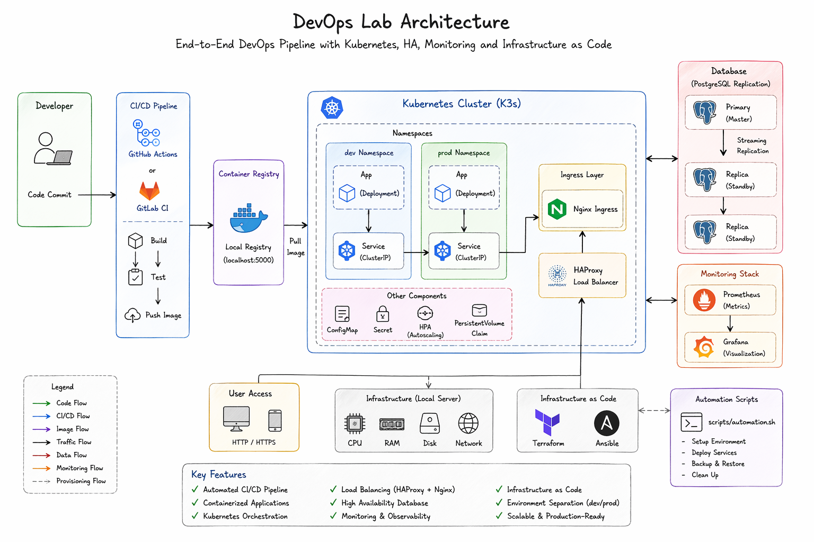

# 🚀 DevOps Lab — End-to-End Infrastructure & CI/CD System

A complete DevOps playground that simulates a production-grade environment using Docker, Kubernetes, CI/CD pipelines, Infrastructure as Code, and Observability tools.

---

## 📐 Architecture Overview



This architecture demonstrates a full DevOps lifecycle including:

- Continuous Integration & Deployment (CI/CD)
- Containerization using Docker
- Kubernetes orchestration (K3s)
- Load balancing (HAProxy + Nginx Ingress)
- PostgreSQL replication (High Availability)
- Monitoring & observability (Prometheus + Grafana)
- Infrastructure as Code (Terraform + Ansible)

---

## 🧠 System Design Flow

```text
Developer
   ↓
Git Push (GitHub / GitLab)
   ↓
CI/CD Pipeline
   ↓
Docker Build → Container Registry
   ↓
Kubernetes Cluster (Dev / Prod)
   ↓
Ingress Controller (Nginx)
   ↓
Load Balancer (HAProxy)
   ↓
Application Services
   ↓
PostgreSQL (Replication)
   ↓
Monitoring (Prometheus + Grafana)


